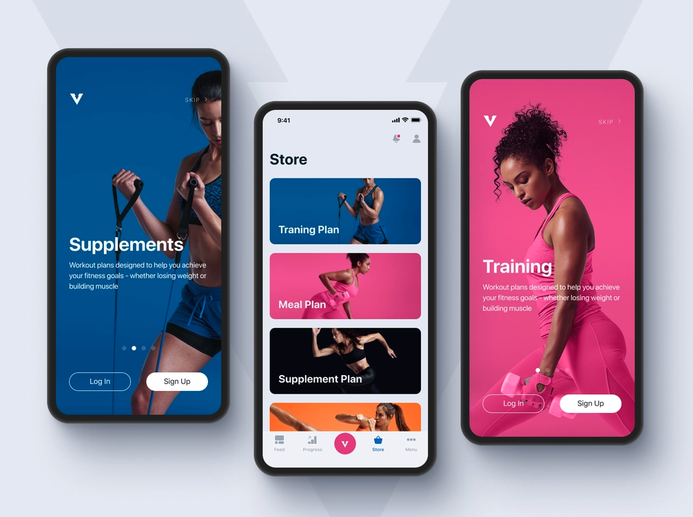

# Ramotion Mockup Design with React Native - Expo

A simple 2 screen mobile app of a mockup design created by Ramotion

 

## APP DEMO

[App Demo](assets/ramotion-mockup.mov)

 

---

## Description

Based on the design created by Ramotion on Dribble, this app contains only 2 screens:

- Login
- Store page

A number of images were used from Unsplash which were added to the project manually (No API involved).

Some external packages from NPM have been included such as:

- Expo
- React Navigation
- React Native Vector Icons

Authentication is basic and maintained within the app utilizing the useState hook from React.

 

---

## Main files

[App.js](App.js)

This file basically contains the Authentication state and displays 2 separate stacks according to whether this value is true or false.

 

[SignedInStack.jsx](screens/navigation/SignedInStack.jsx)

If logged in state in App.js is true, the 'SignedInStack' this component will be displayed. This component contains both Stack and Tab navigation functionality. There are 5 separate tab icons but based on the Ramotion design, only the store tab has been implemented and the remaining screens are empty. The header at the top contains the person icon and it is here that a user can logout as the setIsSignedIn state method has been passed to this component as a prop from App.js.

 

[SignedOutStack.jsx](screens/navigation/SignedOutStack.jsx)

If the logged in state is false, the 'SignedOutStack' component will be displayed. This file contains an array of images that are used in a scroll view with pagination and simple text. The login button will change the state of isSignedIn to 'true' to enable the user to access the SignedInStack components.

 

---

 

This app is a mock up only, most components are similar to the Ramotion design but the images used are different.
